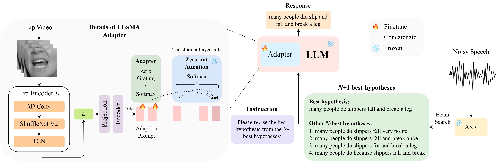

# LipGER
This is the official implementation for our paper [LipGER: Visually-Conditioned Generative Error Correction for Robust Automatic Speech Recognition](https://arxiv.org/abs/2406.04432) at InterSpeech 2024 which is selected for oral presentation.



## LipHyp

You can download the LipHyp data from [here](https://drive.google.com/drive/folders/1ThZcxG5yq_1SfvtnclM3_0trfTUP6W98?usp=sharing)!

## Prepare the environment  

```
pip install -r requirements.txt
```

## Training the LipGER model  

### 1. Prepare the LLM checkpoint  

First prepare the checkpoints using:

```shell
pip install huggingface_hub

python scripts/download.py --repo_id meta-llama/Llama-2-7b-chat-hf --token your_hf_token

python scripts/convert_hf_checkpoint.py --checkpoint_dir checkpoints/meta-llama/Llama-2-7b-chat-hf
```

To see all available checkpoints, run:

```shell
python scripts/download.py | grep Llama-2
```

For more details, you can also refer to [this link](https://github.com/YUCHEN005/RobustGER/tree/master/tutorials), where you can also prepare other checkpoints for other models. Specifically, we use [TinyLlama](https://github.com/jzhang38/TinyLlama) for our experiments.  

### 2. Download the checkpoint for the Lip Motion Encoder  

The checkpoint is available [here](https://drive.google.com/file/d/1RqGd_13BeX1ybD1UPJIu8eDsilCsrAF9/view?usp=sharing). After downloading, change the path of the checkpoint [here](https://github.com/Sreyan88/LipGER/blob/main/lipger/lipger.py#L246).

### 3. Prepare the dataset for training (and inference)  
LipGER expects all train, val and test file to be in the format of [sample_data.json](./data/sample_data.json). An instance in the file looks like:

```
{
        "Dataset": "dataset_name",
        "Uid": "unique_id",
        "Caption": "The ground truth transcription.",
        "Noisy_Wav": "path_to_noisy_wav",
        "Mouthroi": "path_to_mouth_roi_mp4",
        "Video": "path_to_video_mp4",
        "nhyps_base": [ list of N-best hypotheses ],
}
```

#### Step 1: Generate the N-best hypotheses  
You need to pass the speech files through a trained ASR model capable of generating N-best hypotheses. We provide 2 ways in this repo to help you achieve this. Feel free to use other methods.
- Sample code for N-best hypotheses generation using WavLM + ESPnet can be found [here](./data/wavlm). You might need to write a bit of code of getting your files as input to the model. However, the for-loop just expects speech files. Raise an issue if you are gaving difficulties at this point.
- Sample code for N-best hypotheses generation using Whisper can be found [here](./data/nhyps.py). We changed some code in whisper which can be found [here](./data/whisper). If you install whisper using `pip install whisper` and then run [nhyps.py](./data/nhyps.py) from the `data` folder, you should be good!  

Note that for both methods, the first in the list is the best hypothesis and the others are the N-best hypotheses (they are passed as a list `nhyps_base` field of the JSON and used for constructing a prompt in the next steps).  

Additionally, the provided methods use only speech as input. For audio-visual N-best hypotheses generation, we used [Auto-AVSR](https://github.com/mpc001/auto_avsr). If you need help with the code, please raise an issue!  

#### Step 2: Crop Mouth ROI from Videos  

Assuming you have corresponding videos for all your speech files, follow these steps to crop mouth ROI from the videos.

- Install [RetinaFace](./crop_mouth) or [MediaPipe](https://pypi.org/project/mediapipe/) tracker.
- Update the dir_path or txt_file_path in [crop_mouth_script.py](./crop_mouth/crop_mouth_script.py) to the root directory where the mp4 files exist or text file path which has all the paths to mp4 files lsited.
- Run the following command from [crop_mouth](./crop_mouth) directory to crop mouth ROI:
  ```
  python crop_mouth_script.py
  ```
  The cropped mp4 files will be saved to same loaction as that of the full video with "_crop.mp4" extension.
#### Step 3: Convert the cropped mouth ROI to hdf5 format
- Update the path to json file (dataset_path) in [convert_lip.py](./crop_mouth/convert_lip.py), and run the following command:
```
python covert_lip.py
```
This will convert the mp4 ROI to hdf5, the code will change the path of mp4 ROI to hdf5 ROI in the same json file. 
You can choose from "mediapipe" and "retinaface" detectors by changing the "detector" in [default.yaml](./crop_mouth/default.yaml)

#### Step 4: Construct the required JSON file  

After you have the N-best hypotheses, construct the JSON file in the required format. We do not provide specific code for this part as data preparation might differ for everyone, but the code should be simple. Again, raise an issue if you have any doubts!

#### Step 5: Convert the JSON to a pt file

LipGER training scripts don't take in JSON for training or evaluation. You need to convert them into a pt file. You can run [convert_to_pt.py](./data/convert_to_pt.py) to achieve this! Change `model_name` according to your wish in line 27 and add the path to your JSON in line 58.  

### 4. Fine-tune LipGER  

To finetune LipGER, just run:

```
sh finetune.sh
```
where you need to manually set the values for `data` (with the dataset name), `--train_path` and `--val_path` (with absolute paths to train and valid .pt files).

## LipGER inference  

For inference, first change the respective paths in [robust_ger.py](./inference/robust_ger.py), and then run (with the appropriate test data path):  

```
infer.sh
```

## 🌻 Acknowledgement  
The code for cropping mouth ROI is inspired from [Visual_Speech_Recognition_for_Multiple_Languages](https://github.com/mpc001/Visual_Speech_Recognition_for_Multiple_Languages).

Our code for LipGER is inspired from [RobustGER](https://github.com/YUCHEN005/RobustGER/tree/master). Please cite their paper too if you find our paper or code useful.  

## 🔏 Citation    

```
@inproceedings{ghosh23b_interspeech,
  author={Sreyan Ghosh and Sonal Kumar and Ashish Seth and Purva Chiniya and Utkarsh Tyagi and Ramani Duraiswami and Dinesh Manocha},
  title={{LipGER: Visually-Conditioned Generative Error Correction for Robust Automatic Speech Recognition}},
  year=2024,
  booktitle={Proc. INTERSPEECH 2024},
}
```
